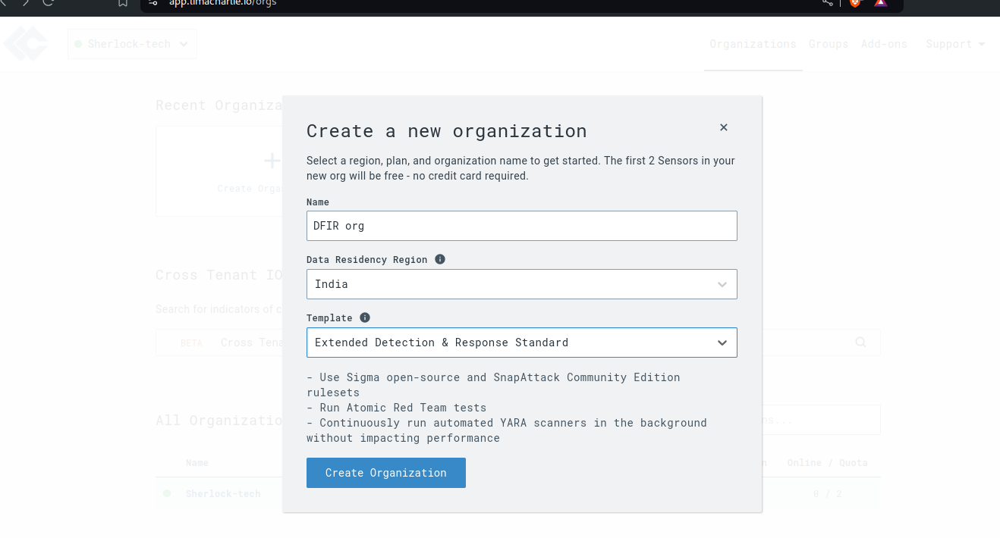
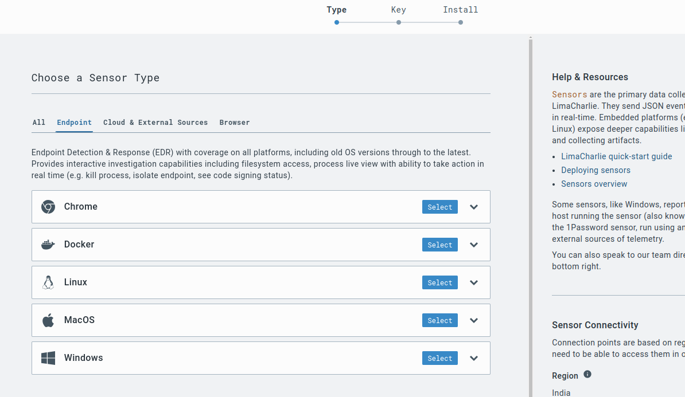
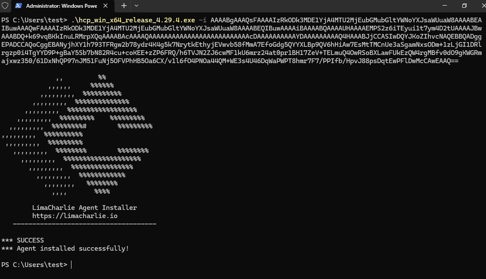
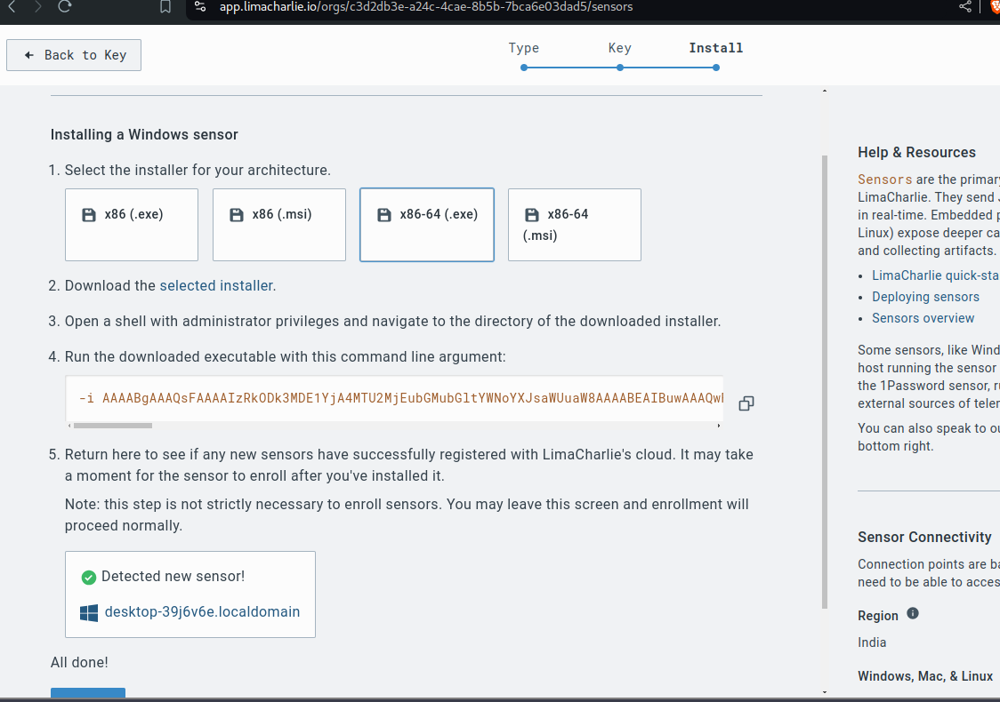

# Limacharlie EDR HOME LAB

## Objectives

1. Install LimaCharlie sensor on a Windows machine to collect telemetry.
2. Create a Sliver payload on Kali Linux to launch an attack on the Windows system.
3. Execute the attack and establish a Sliver session with the target.
4. Dump `lsass.exe` memory from the compromised Windows machine for credential dumping.
5. Create a detection rule in LimaCharlie to identify and alert on `lsass.exe` dumping activity.

## Network Configuration

- **Network:** 10.10.10.0/24
- **Windows Enterprise Machine:** 10.10.10.155
- **Kali Linux (Sliver Server):** 10.10.10.140

## Installation and Configuration of LimaCharlie Sensor on Windows Enterprise

