# Limacharlie EDR HOME LAB

## Objectives

1. Install LimaCharlie sensor on a Windows machine to collect telemetry.
2. Create a Sliver payload on Kali Linux to launch an attack on the Windows system.
3. Execute the attack and establish a Sliver session with the target.
4. Dump `lsass.exe` memory from the compromised Windows machine for credential dumping.
5. Create a detection rule in LimaCharlie to identify and alert on `lsass.exe` dumping activity.

## Network Configuration

- **Network:** 10.10.10.0/24
- **Windows Enterprise Machine:** 10.10.10.155
- **Kali Linux (Sliver Server):** 10.10.10.140

## Installation and Configuration of LimaCharlie Sensor on Windows Enterprise

# Setting Up Sliver Implant on Kali Linux and Deploying to Windows

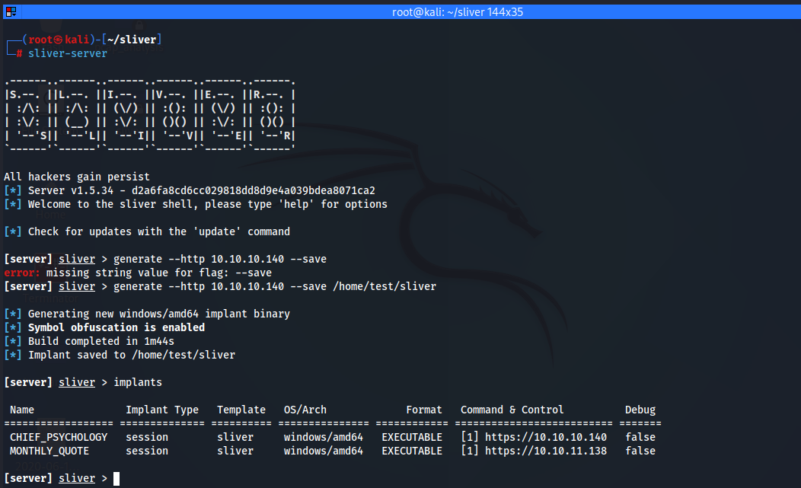

### Set Up Python Server and Deploying C2 Implant

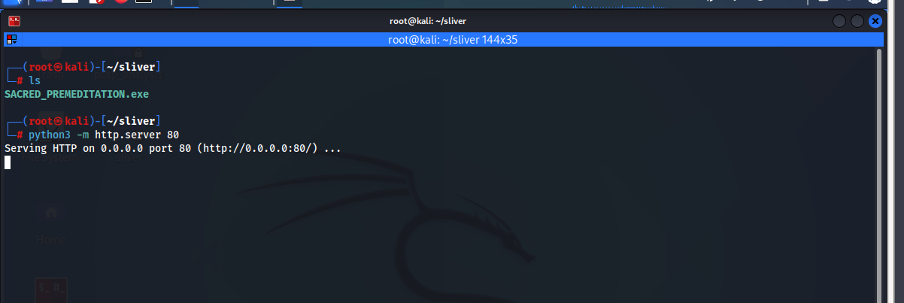

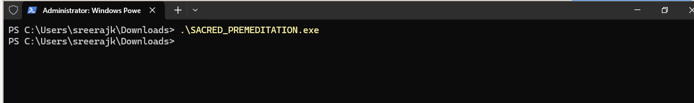

### We Got the Sliver Session

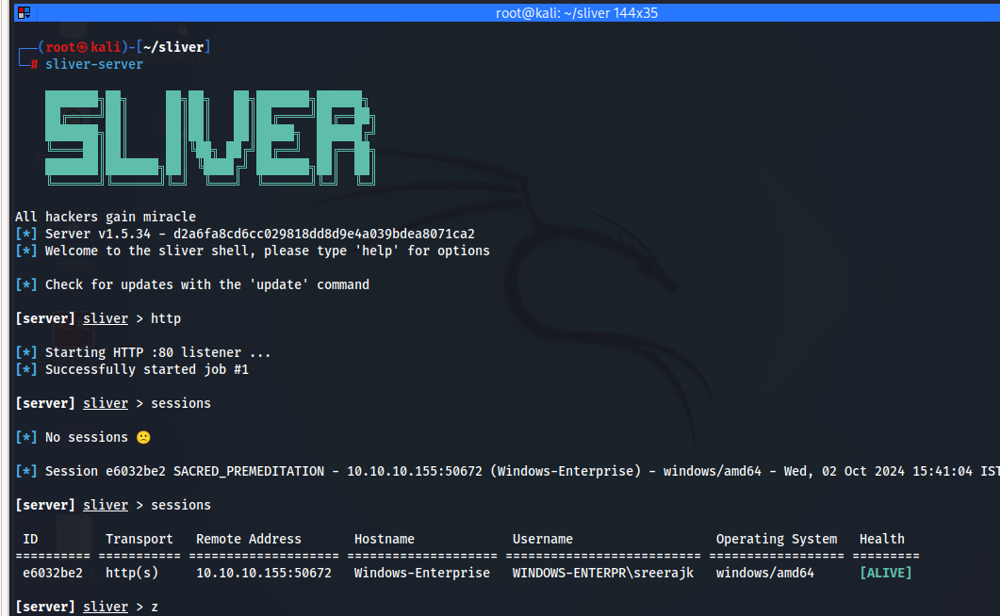
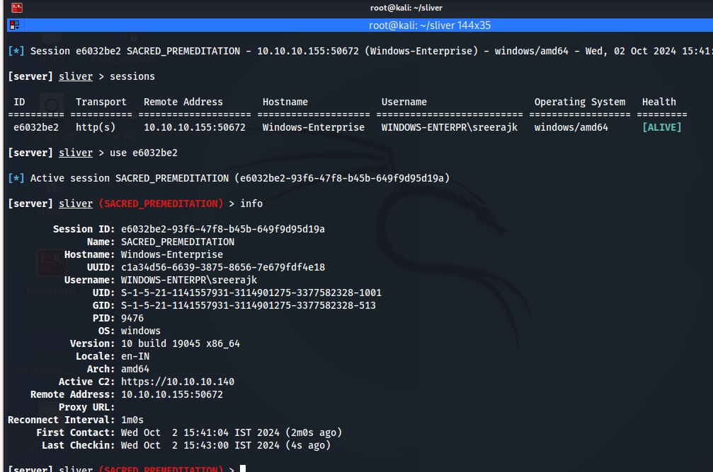

### On LimaCharlie

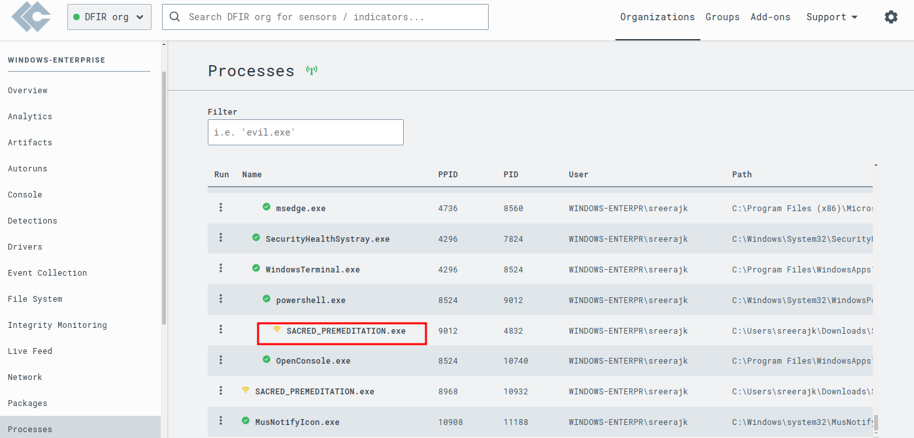
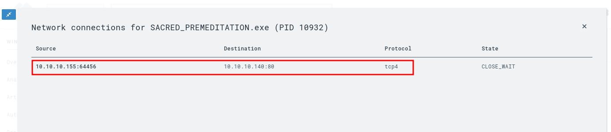
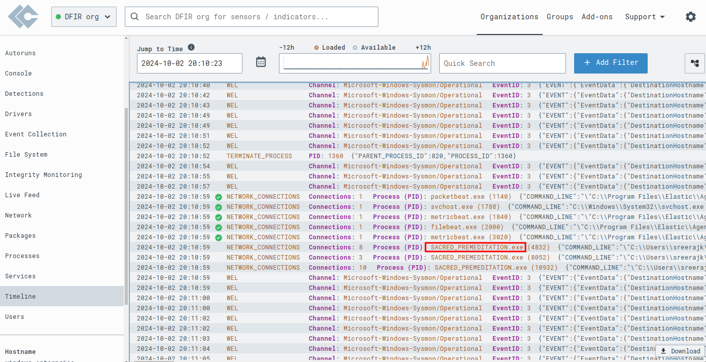

## Generating Telemetry by Dumping `lsass.exe`

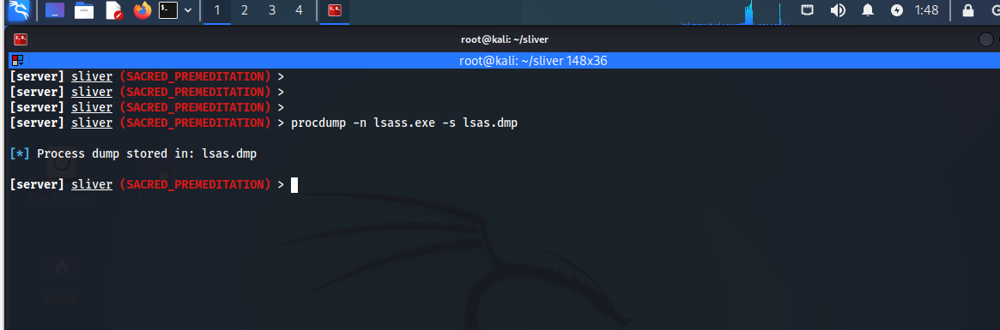

### Create Detection Rule to Detect LSASS Dumping

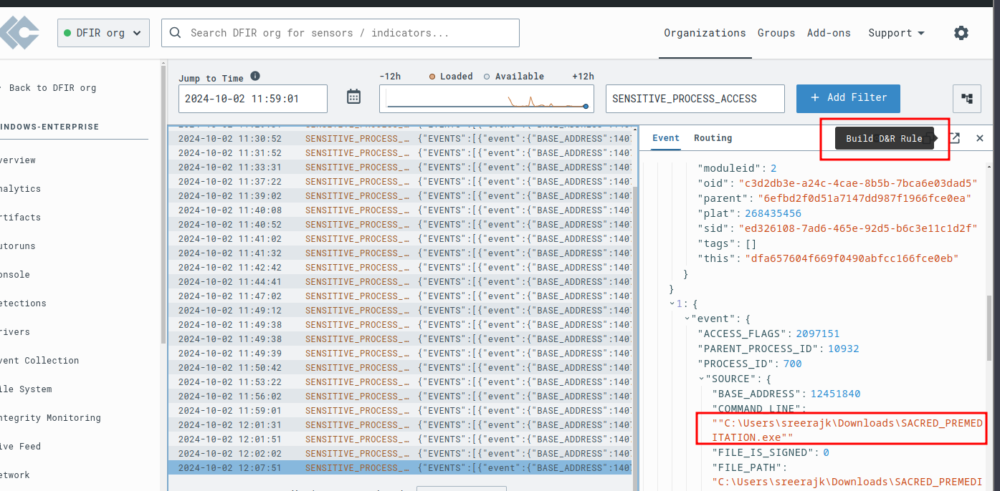
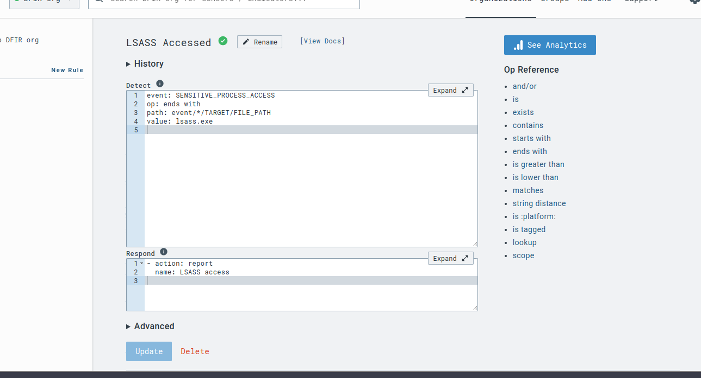

Now we have a simple detection rule to identify credential dumping. Let’s test it again by generating telemetry through dumping `lsass.exe` once more.

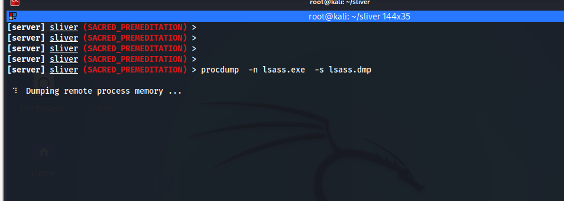

We’ve successfully detected the `lsass.exe` dumping with our detection rule. Additionally, LimaCharlie’s built-in detection rules also identified our C2 server, marking it as the Sliver Hacktool.

## Conclusion

In this project, a LimaCharlie EDR environment was successfully set up, and a Sliver implant was deployed on a Windows machine. The intricacies of collecting telemetry data, particularly through memory dumping techniques, were learned, along with the development of effective detection rules for identifying credential dumping activities. This hands-on experience enhanced the understanding of endpoint detection and response, as well as the practical application of offensive security tools in a controlled lab setting. Overall, this project has deepened knowledge of both attack and defense mechanisms in cybersecurity.

